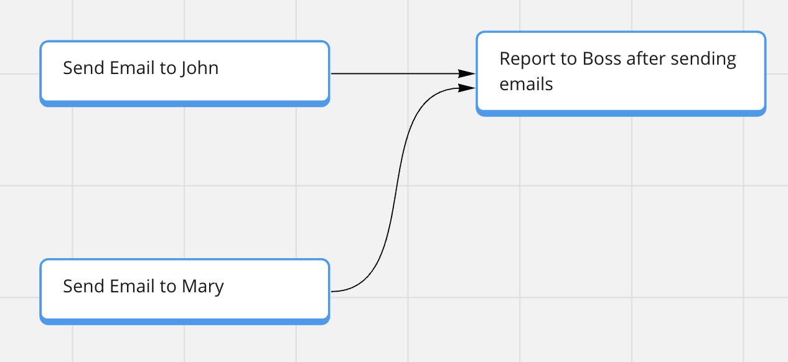

# Dandori（段取り）


*This project is experimental.*

Dandori analyzes and visualizes the dependencies of your tasks.

Let's look at a few examples.

## Example 1

### Input

```text
Today's My Tasks
* Send Email to John
* Send Email to Mary
* Report to Boss after sending emails
```

### Output（Miro）



## Example 2

### Input

```text
Today's My Tasks
* [todo] Send Email to John
* [doing] Write a blog
* [done] Report to Boss
```

### Output（Notion）


## Usage

This project is monorepo. You can choose the following ways to use it.

### Use CLI

Please read [`@dandori/cli` README](./packages/cli/README.md).

### Use your own code

Please read [`@dandori/core` README](./packages/core/README.md) and [`@dandori/ui` README](./packages/ui/README.md).

### License

Released under the MIT license.