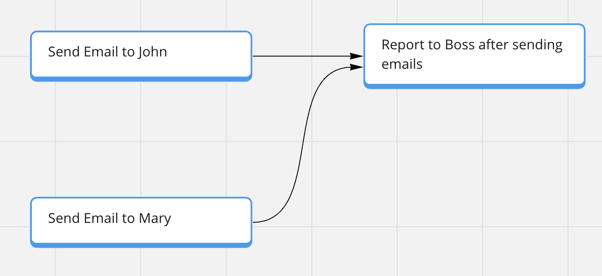
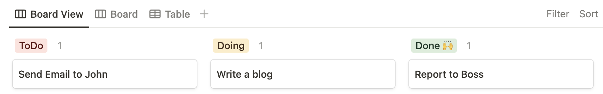

# dandori/ui

This repository is responsible for viewing your tasks which are generated by `@dandori/core` .

## Installation

```bash
npm install @dandori/core @dandori/ui
yarn add @dandori/core @dandori/ui
pnpm add @dandori/core @dandori/ui
```

## Usage

```ts
import generateDandoriTasks from '@dandori/core';
import { generateDandoriMiroCards } from "@dandori/ui";

const text = `
Today's My Tasks
* Send Email to John
* Send Email to Mary
* Report to Boss after sending emails
`;

const tasks = await generateDandoriTasks(text);
await generateDandoriMiroCards(tasks, {
  boardId: '1234567890',
});
```

## Requirements

* Please see [@dandori/core](../core/README.md) before using `@dandori/ui`.
* `@dandori/ui` depends on external APIs. You need to set `EXTERNALAPP_API_KEY` environment variables like `MIRO_API_KEY` .
* `@dandori/ui` supports to load `.env` file. Please create `.env` file and set environment variables.

## Supported External APIs

* [Miro](https://miro.com/)
* [Notion](https://www.notion.so/)

## API

### generateDandoriMiroCards

```ts
async function generateDandoriMiroCards(
  tasks: DandoriTask[],
  options?: GenerateDandoriMiroCardsOptions,
): Promise<void> {}
```

`generateDandoriMiroCards` creates miro cards from `generateDandoriTasks` result.



#### Parameters

##### tasks

The tasks which are generated by `generateDandoriTasks` of `@dandori/core`.

##### options

```ts
interface GenerateDandoriMiroCardsOptions {
  boardId?: string;
  isAppCard?: boolean;
  apiKey?: string;
}
```

* boardId

The existing board id of miro.

You can get the board id from the miro url of the board.

For example, if the url is `https://miro.com/app/board/1234567890/`, the board id is `1234567890`.

If not set, the new board is created.

* isAppCard

**default is `false`**

If you set `true` , the cards are created as [App cards](https://developers.miro.com/docs/app-card).

* apiKey

The api key of miro. You can also set `MIRO_API_KEY` environment variable instead of this option.

### generateDandoriNotionPages

```ts
async function generateDandoriNotionPages(
  tasks: DandoriTask[],
  options?: GenerateDandoriNotionPagesOptions,
): Promise<void> {}
```

`generateDandoriNotionTasks` creates notion pages from `generateDandoriTasks` result.



#### Parameters

##### tasks

The tasks which are generated by `generateDandoriTasks` of `@dandori/core`.

##### options

```ts
interface GenerateDandoriNotionPagesOptions {
  databaseId: string;
  databasePropertiesMap?: DatabasePropertiesMap;
  apuKey?: string;
}
```

* databaseId

The existing database id of notion.

You can get the database id from the notion url of the database.

For example, if the url is `https://www.notion.so/myworkspace/1234567890?v=123`, the database id is `1234567890`.

* databasePropertiesMap

**default is `{ name: 'Name' }`**

The map which key is defined by dandori and value is your notion database properties.

You can set the key like belows.

```ts
const databasePropertiesMap = {
  name: "",
  deadline: "",
  description: "",
  status: "",
  "status.todo": "",
  "status.doing": "",
  "status.done": "",
};
```

```ts
import generateDandoriTasks from '@dandori/core';
import { generateDandoriNotionPages } from "@dandori/ui";

const text = `
Today's My Tasks
* Send Email to John
* Send Email to Mary
* Report to Boss after sending emails
`;

const databasePropertiesMap = {
  status: "Status",
  "status.todo": "ToDo",
  "status.doing": "Doing",
  "status.done": "Done 🙌",
};

const tasks = await generateDandoriTasks(text);
await generateDandoriNotionPages(tasks, {
  databaseId: '1234567890',
  databasePropertiesMap,
});
```

This is an example. In this case, the output is like belows.


For more details about database properties, please see [Notion API](https://developers.notion.com/reference/page#page-property-value).

* apiKey

The api key of miro. You can also set `NOTION_API_KEY` environment variable instead of this option.